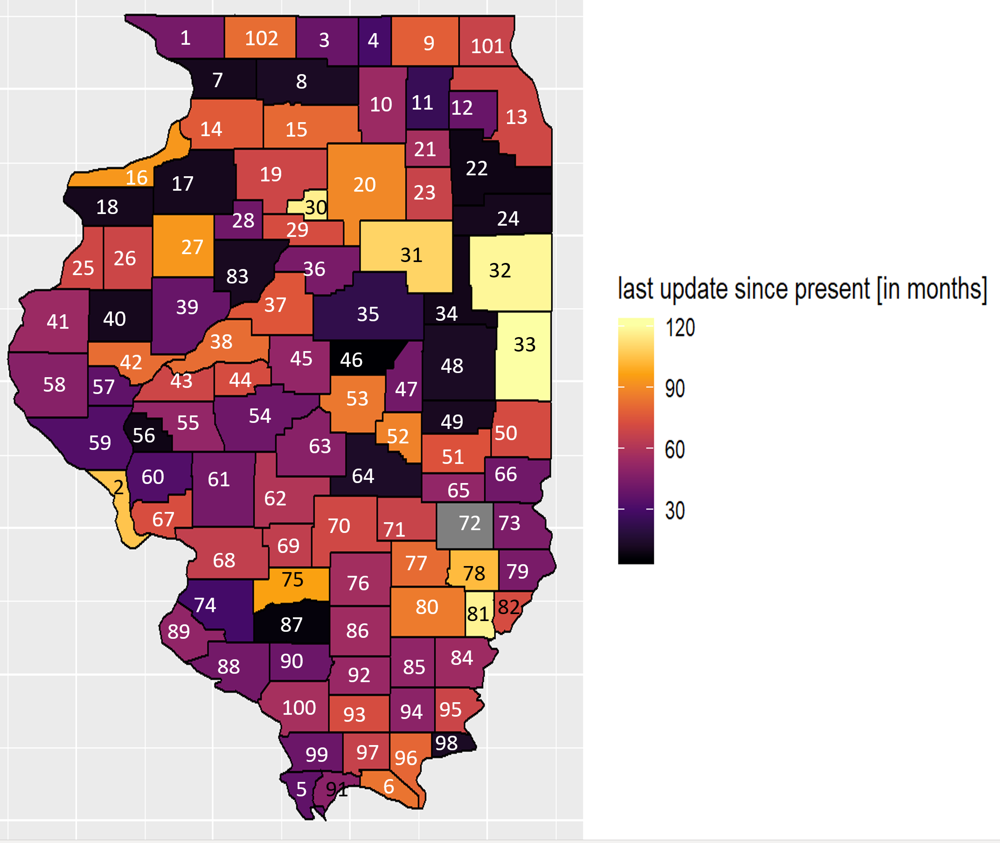
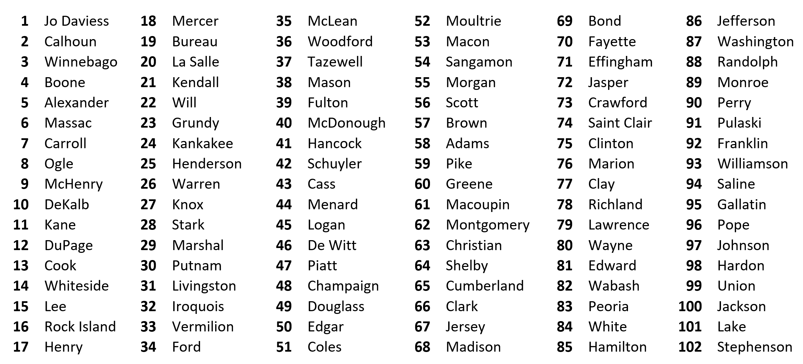

# Air-Quality-Data-Analysis
<h1 align="center">
   
  
   
  Damini K Rijhwani
   
</h1>

<h4 align="center"> Google Street View Dataset</h4>

  
  
  
  
  
  

   <a href="#key-features">Key Features</a> •
  <a href="#intro">Intro</a> •
  <a href="#Approach-to-Problem">Approach to Problem</a> •
  <a href="#download">Download</a>

 

## Key Features 

Heatmaps produces using Google API to collect images on large scale

## Intro 

The motivation of this project stems from the increasing use of google street view images in machine 
learning models, to predict outcomes. In the recent affairs of fair AI,
it seemed appropriate to study the large dataset and analyze potential bias.

## Approach to Problem

My approach to solving this problem was to gather 100 longitude and latitude coordinate of a location for each county,
 in which at each coordinate a street view image is requested. If a street exist than an image is quarried, and the 
 update time is saved. The average of  update times in each county is then calculated and represented on a heatmap. 
 The distribution on the heatmap helps asses the distribution of the last update Google Street View has had 
 and can be correlated to several factors and analyzed. 

## Download 
Clone the github repo including source. 

---
> LinkedIn [Damini K Rijhwani](https://www.linkedin.com/in/drijhwan) 
> GitHub [@DaminiR](https://github.com/daminiR/)  
> AI Blog  [Disrupt Culture](https://thedisruptculture.com/)  
